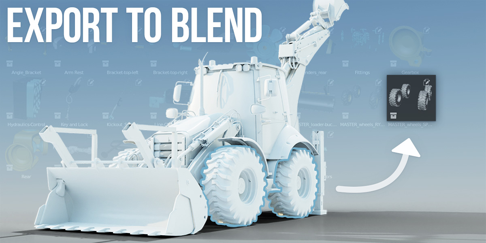

Support development by purchasing Export to Blend on the **[Blender Market](https://blendermarket.com/products/export-to-blend)**.

Export to Blend is a simple add-on that creates a new blend file based on your selection of objects, collections, or nodes. Exports can be marked as assets, which makes it easy to build out an asset library while creating a scene. Exports can also be backlinked, meaning that the original object in your scene will be replaced with a linked version from the new file. It works from Blender's File / Export menu and from the Outliner's context menu. 

## Current Features
  * Export selected objects to `.blend` file
  * Export selected objects to `.blend` file from the Outliner
  * Export selected collections to `.blend` file from the Outliner
  * Optionally create a collection of your selected objects prior to export
  * Optionally mark your exported objects or collection as an Asset for the Asset Browser when exporting 
  * Optionally "backlink" your exported objects or collection, replacing assets in your current file with a library link to your exported assets
  * Export selected nodes to `.blend` file from a Node Editor

**[Read the full documentation.](https://cgcookie.github.io/io_export_blend/)**