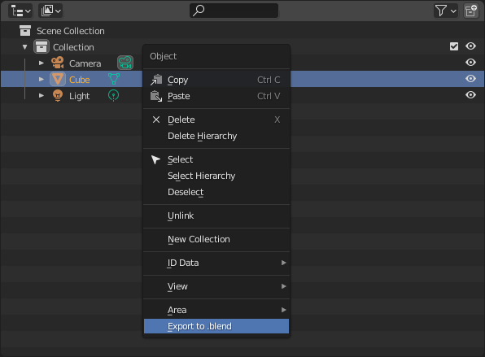

# Usage

## Exporting from the File Menu
Like most exporter add-ons, you can use Export to Blend from the File > Export menu. The default behavior exports the selected objects from the current 3d scene to a new blend file. If the option is grayed out, switch to Object Mode. The File Browser that appears when executing this operator gives you a few options. 

### Export Selected 
Disabling Export Selected is essentially the same as a Save As operation, so it's very rare that you'll need to turn it off. It's included in the add-on to match the other exporters and for troubleshooting broken blend files. 

### Export as Collection
Enable Export as Collection to bundle your selected objects in a collection when exporting. This collection only exists in your export file and does not persist in your current file. A Collection Name option appears when this is enabled so you can choose what to call it. 

### Mark as Asset
If you export to an Asset folder that Blender recognizes and enable Mark as Asset, your export should appear in your Asset Browser. If you choose to export your objects as a collection, only that collection will be marked as an asset, not all of the constituent objects inside that collection. 

### Backlink 
This is a fun one. After exporting your objects (or objects bundled in a collection) to a separate .blend file with Backlink enabled, all of the selected objects in your scene will be replaced with a linked library asset that points to the file you just exported.

## Exporting from the Outliner
This add-on also adds export options to the Outliner's context menu. If you select multiple objects in the Outliner, you can right-click your selection and choose Export to .blend. The File Browser will appear as described in the previous section.

Additionally, if you select a collection in the Outliner (currently this add-on only supports exporting one collection at a time), the Export to .blend option will also appear in the context menu. In this case, the File Browser options are much more limited and you can only choose if that collection is to be marked as an Asset when exporting.

## Exporting Nodes
This add-on also provides the ability to export selected nodes to a separate .blend file. From the Shader Editor, Compositor (not currently supported due to Blender bug **[T88402](https://developer.blender.org/T88402)**), Texture Node Editor, or Geometry Node Editor, navigate to Node > Export to .blend. When activating this operator, you get a File Browser with the following option:

### Export Selected
Keeping this option enabled exports all selected nodes to their own .blend file. If you disable this option, the whole active node tree will be exported, but only the node tree in the current Node Editor.

### Export as Node Group
Similar to the Export as Collection option for objects, you can choose to optionally bundle your selected nodes in a group prior to exporting. If you choose to export your nodes as a group, you can name it with the Group Name property. The default name is export_group. When exporting nodes as a node group, you will likely need to manage input and output sockets yourself.

If you try to export a node that is within an existing node group, this add-on doesn't quite function as expected. Currently, it clears out just the other nodes within that group, but nothing in the group's parent tree.

### Backlink 
If you choose to bundle your nodes in a group when exporting, you have the option of replacing them with an instance of the node group you just exported, just like the corresponding option for objects and collections.

## Notes
The exported file is just an empty scene. The node tree you exported has a fake user. In order to see that node tree, you need to add whatever asset would make use of your node tree. For example, if your nodes belong to to a shader, then you need to add an object to the 3D scene and give it the shader you exported.

Exporting groups from custom nodes such as Sverchok or Animation Nodes is currently untested.

When enabling the Mark as Asset option, the text size of menu items in Blender's UI gets much larger. This is related to Blender bug **[T83896](https://developer.blender.org/T83896)** and should hopefully be fixed soon.