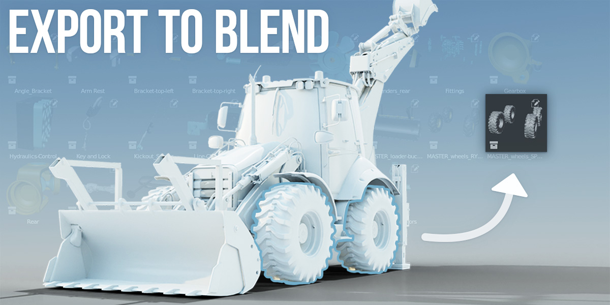

# Build out your asset library
If you look on **[Right-Click Select](https://rightclickselect.com/)** (the feature request site for Blender), you'll notice that one of the frequently requested features is the ability to save or otherwise export just part of your active blend file to a separate file. 

Export to Blend is a simple add-on that creates a new blend file based on your selection of objects, collections, or nodes. Exports can be marked as assets, which makes it easy to build out an asset library while creating a scene. Exports can also be backlinked, meaning that the original object in your scene will be replaced with a linked version from the new file. It works from Blender's File / Export menu and from the Outliner's context menu. 

Creating a new file with just one asset is very helpful for managing data in larger projects. Let's say you're working on a scene, and you've added a prop to it, but then you realize that the prop is going to be necessary in multiple scenes. If you use Export to Blend, you can simply push the prop to its own file and quickly link it to your other scenes in just a few clicks. 

## Current Features
  * Export selected objects to `.blend` file
  * Export selected objects to `.blend` file from the Outliner
  * Export selected collections to `.blend` file from the Outliner
  * Optionally create a collection of your selected objects prior to export
  * Optionally mark your exported objects or collection as an Asset for the Asset Browser when exporting 
  * Optionally "backlink" your exported objects or collection, replacing assets in your current file with a library link to your exported assets
  * Export selected nodes to `.blend` file from an Node Editor

Export to Blend is a free add-on which you can find on **[GitHub](https://github.com/CGCookie/io_export_blend)**, or you can support development by purchasing it on the **[Blender Market](https://blendermarket.com/products/export-to-blend)**.